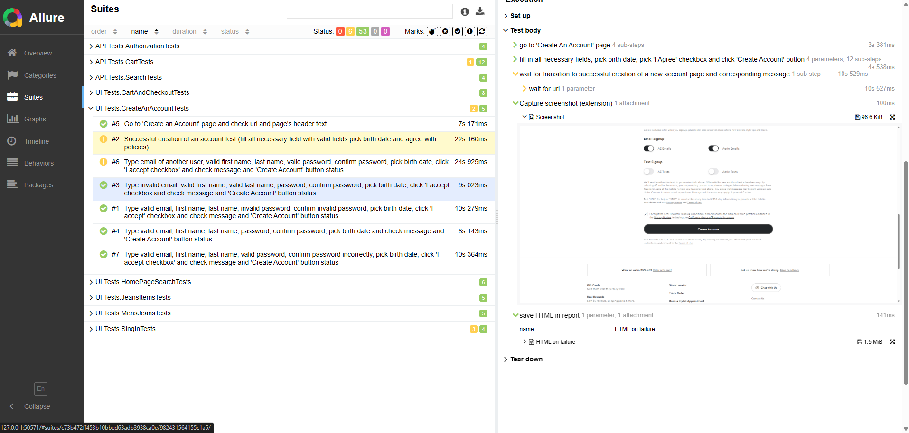

# 📦 AEO Automated Testing Project

[](https://github.com/Alex-V0l/AEOTests/actions/workflows/aeotests-ci-no-defects.yml)
[](https://www.oracle.com/java/)
[](https://gradle.org/)
[](https://docs.qameta.io/allure/)

This is a **graduation project** completed as part of the advanced Java automation testing course by [Gennady Chursov](https://github.com/topsycreed).  
The project focuses on testing the e-commerce website [ae.com](https://www.ae.com/us/en/) the official online store of **American Eagle Outfitters (AEO)** - well-known American lifestyle, clothing, and accessories retailer.

The test suite is structured and developed in stages:
- ✅ API test development (RESTful endpoints)
- ✅ UI test automation using Selenium
- ✅ ✅ CI/CD integration via GitHub Actions and Allure Reports

---

## 📚 Contents

+ [💻 Tech Stack](#-tech-stack)
+ [🧪 Covered Test Scenarios](#-covered-test-scenarios)
+ [🚀 How to Run the Project](#-how-to-run-the-project)
   - [🔸 Run Locally (via IntelliJ or Terminal)](#-run-locally-via-intellij-or-terminal)
   - [🔹 Run via GitHub Actions](#-run-via-github-actions)
+ [📊 View Allure Report](#-view-allure-report)
   - [📍 Locally](#-locally)
   - [📈 View Allure Report in GitHub Actions](#-view-allure-report-in-github-actions)

## 💻 Tech Stack

<p align="center"> 
<a href="https://www.oracle.com/java/" target="_blank">  </a> 
<a href="https://junit.org/junit5/" target="_blank">  </a> 
<a href="https://rest-assured.io/" target="_blank">  </a> 
<a href="https://www.selenium.dev/" target="_blank">  </a> 
<a href="https://gradle.org/" target="_blank">  </a> 
<a href="https://www.jetbrains.com/idea/" target="_blank">  </a> 
<a href="https://github.com/" target="_blank">  </a> 
<a href="https://docs.github.com/en/actions" target="_blank">  </a> 
<a href="https://docs.qameta.io/allure/" target="_blank">  </a> 
</p>

---

## 🧪 Covered Test Scenarios

### 🔬 Test Types:
- **Smoke tests**
- **Negative scenarios**
- **Extended (end-to-end) coverage**

---

### 🔧 API Tests:

| Area         | Description |
|--------------|-------------|
| **Authorization** | Guest token retrieval using `POST` request |
| **Search**        | Product search with `GET` |
| **Cart**          | Full cart functionality using `POST`, `GET`, `PATCH`, and `DELETE`: add, view, update, and remove products |

---

### 🖥️ UI Tests:

| Module | Description |
|--------|-------------|
| **Account Creation** | Navigate to sign-up page, fill out forms, interact with dropdowns and checkboxes |
| **Login** | Open modal, fill login fields |
| **Search** | Interact with search modal, validate suggestions dropdown, and check navigation to results page |
| **Category Page** | Test filters (checkboxes, radio buttons), navigate to product page |
| **Product Page** | Change color via radio buttons, choose size from dropdown, adjust quantity, add to cart |
| **Cart Functionality** | Add via search/category, validate product info, update quantity, remove product, proceed to checkout, update shipping method |

📄 For a more detailed overview of the testing logic and structure, please refer to the following resources:

- 🧭 [Test Plan (PDF)](src/test/resources/TestPlan.pdf)
- 📝 [Test Case Spreadsheet (Google Sheets)](https://docs.google.com/spreadsheets/d/1mDBVcW8GYeTNyTupHtu3_jyOoKpW1UHl7aHtPIcrdRg/edit?usp=sharing)

---

## 🚀 How to Run the Project

### ⚠️ Note: Anti-bot protection on the tested website

Since this project tests a **real website**, it uses **anti-bot protection (e.g., Akamai)**, which can block automated test traffic. As a result, **some tests consistently fail**, even when they are implemented correctly. These tests are explicitly marked with the tag `@Tag("defect")`.

Therefore, there are **two execution modes**:

### 🔸 Run Locally (via IntelliJ or Terminal)

1. Open the **Gradle panel** in IntelliJ
2. Execute the following task:

#### 💥 Run all tests:

   ```bash
      gradle clean test -Denv=prod
   ```

#### ✅ Run only stable tests (excluding @Tag("defect")):

   ```bash
      gradle clean testWithoutDefects -Denv=prod
   ```

---

### 🔹 Run via GitHub Actions

To run 💥 all tests using GitHub Actions:

1. Go to the **[Actions](https://github.com/Alex-V0l/AEOTests/actions)** tab of the repository.
<p align="center">  </p>
2. Select the workflow named: `AEOTests CI`
<p align="center">  </p>
3. Click **Run workflow** (top-right), then confirm.
<p align="center">  </p>
4. Wait for the job to complete and check the status.
<p align="center">  </p>

---

To run ✅ only stable tests using GitHub Actions:

1. Go to the **[Actions](https://github.com/Alex-V0l/AEOTests/actions)** tab of the repository.
<p align="center">  </p>
2. Select the workflow named: `AEOTests CI (no defects)`
<p align="center">  </p>
3. Click **Run workflow** (top-right), then confirm.
<p align="center">  </p>
4. Wait for the job to complete and check the status.
<p align="center">  </p>
---

## 📊 View Allure Report

### 📍 Locally

To view the report, after the execution of tests locally has been completed:

```bash
  cd ./build/
  allure serve
```

---

## 📈 View Allure Report in GitHub Actions

After the CI build completes:

1. Go to the **[Actions](https://github.com/Alex-V0l/AEOTests/actions)** tab.
<p align="center">  </p>
2. After the workflow run go to the `pages-build-deployment` job.
<p align="center">  </p>
3. Go inside workflow and wait for deployment to be completed
<p align="center">  </p>
4. Click on the generated **Deploy link**.
<p align="center">  </p>
5. The Allure Report will open in a new browser tab, where you can explore request/response body for API tests and screenshots, html for fallen UI tests.
<p align="center">  </p>
<p align="center">  </p>
<p align="center">  </p>